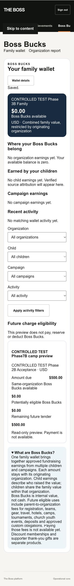

# Phase 7B hosted acceptance and cleanup

Phase 7B is COMPLETE within its approved internal, non-spending boundary.
This record supplements the architecture, SQL validation and performance reports.
It does not represent runtime evidence as hosted evidence.

## Fixed window, October 7, 2026 UTC

| Event | Exact time |
| --- | --- |
| Activation audit transaction timestamp | 04:10:14.545455 |
| Effective window start returned by canonical clock | 04:10:14.546589 |
| Native wallet provision audit | 04:10:43.956837 |
| Guardian-revocation audit | 04:13:55.462409 |
| Guardian capability removal completed | 04:13:55.473827 |
| Administrator-first preservation and cleanup audit | 04:18:37.251940 |
| Explicit restoration completed | 04:18:37.275568 |
| Zero-residual wallet/fixture proof | 04:18:43.817778 |
| Sports baseline proof | 04:18:46.374576 |
| Relationship business-state equality proof | 04:19:39.887911 |
| Retired wallet/ended access and unchanged payment proof | 04:19:44.328150 |
| Stop-new-scenarios deadline | 04:25:14.546589 |
| Explicit cleanup target | 04:30:14.546589 |
| Hard expiry | 04:40:14.546589 |

The window was not extended. Explicit cleanup finished before both deadlines.
The original administrator assignment was never deactivated or expanded.
No new identity, organization role, team role or organization membership was created.
Temporary authority comprised the exact Child1 wallet/payment guardian flags,
the existing actor household membership, one bounded Child1 household membership
and one bounded Boss Bucks module configuration. Other guardian flags remained
false. The existing Child1 organization relationship was unchanged.

## Hosted results

| Scenario | Classification and result |
| --- | --- |
| Module activation and native wallet provision | HOSTED VERIFIED. One canonical USD household wallet and one signed provision receipt. Success displayed; no grant, journal or posting. |
| Authorized family wallet | HOSTED VERIFIED. $0.00 available; correct organization, child, campaign and activity empty states; filters, explanation and membership separation visible. |
| Navigation and full reload | HOSTED VERIFIED. Wallet and Family Hub retained correct current authority and empty-wallet/charge projections through native navigation and reload. |
| Organization report | HOSTED VERIFIED. Own-organization restriction copy, no earnings/source history, default no issuance policy. No cross-organization family total. |
| Charge preview | HOSTED VERIFIED. Synthetic camp charge: $500 due, $0 same-organization available, $0 potentially eligible and $500 remaining future tender. Explicit read-only/no payment text. |
| Guessed wallet identifier | HOSTED VERIFIED. Unknown wallet identifier returned restricted/module-unavailable result without ledger data. |
| Guardian revocation / household-only access | HOSTED VERIFIED. Known wallet denied immediately after wallet/payment capabilities were removed while household memberships and the raw access row remained active. Family view showed no authorized wallet or charges. |
| Final ended access / module off | HOSTED VERIFIED. Known retired wallet remained denied after complete cleanup. Original administrator Home remained available. |
| 1280, 768, 390 and 320 layouts | HOSTED VERIFIED for wallet, charge preview, Family Hub and organization empty report. Final 320px organization report has innerWidth = scrollWidth = 320. |
| Positive issuance, attributed balances, duplicate source and trusted reversal | SQL/RUNTIME VERIFIED; HOSTED POSITIVE UNVERIFIED DUE TO APPROVED NON-PAYMENT SOURCE LIMITATION. Canonical trusted contribution success evidence is zero. |
| Two organizations, two children, transfer, expiration and rebuild equality | SQL/RUNTIME VERIFIED. No canonical synthetic paid evidence was created to demonstrate these positives. |
| Actual unrelated-household/child/organization wallets, restricted finance/team roles and forged signed POST matrix | SQL/RUNTIME VERIFIED. Not reclassified as hosted positives/negatives from the single-account hosted checks. There was no separate unrelated canonical wallet fixture or identity in this window. |

Actual React components also passed local rendered validation at all four widths,
including synthetic positive balances and history. This local evidence is not
hosted issuance evidence. Visible controls have labels; amounts and statuses use
text, not color alone. No claim of a comprehensive assistive-technology audit.

## Narrow fixes and rolled-back recovery attempts

Before activation, focused explicit-access regression found a shared identity
trigger resolving a wallet-only field on an access row. Corrective migration
20261007040726 dispatches by table first without weakening identity invariants.
All six wallet SQL suites and eleven races passed afterward.

Hosted 320px organization selection initially overflowed to 351px because its
form sits outside the wallet shell. Commit
95a044723a921171936e9081f1282f6de35c708d extends the existing form-control sizing
rule. The updated local fixture includes that outer selector. Typecheck,
zero-warning lint, 454 tests and build passed; the actual hosted report was
reloaded and verified at 320px before cleanup.

One preactivation transaction attempted to change immutable historical starts_at
fields. It rolled back in full, with zero new module, wallet or activation audit
rows. The corrected activation preserved those fields and opened the sole
effective window. No deadline or authority window was extended.

The first cleanup transaction at 04:18:11 UTC violated the audit platform-scope
constraint and rolled back in full. Its platform-administrator audit entry
incorrectly supplied an organization. The private recovery entry was corrected
to the existing platform audit contract and immediately rerun successfully.
No schema, ACL or security rule was changed to permit recovery. No timing overrun.
Private recovery scripts are intentionally excluded from repository evidence.

## Explicit cleanup and baseline evidence

Administrator preservation ran first. Explicit wallet access ended; the empty
wallet was retired through the supported private operation. All temporary guardian
capabilities, household authority and Boss Bucks module configuration were removed
or restored. The preview charge is canceled, its registration/offering archived.
No immutable financial posting was edited or deleted. There were no financial
effects to reverse: grants, journals, postings, earning policies and trusted sources
all remain zero. Payments and allocations remain their original six rows each.

Role, module, organization and team hashes match the recorded baseline exactly.
Guardian and original household membership business fields also match exactly;
their standard updated_at timestamps now record restoration. Full-row hashes
therefore differ for those two historical rows. Normalizing only those expected
updated_at fields proves equality across every other field and historical row.
No trigger was disabled or audit metadata backdated to manufacture hash equality.
The new ended membership/module and immutable wallet/access/audit history remain
as clearly identified inactive evidence, not active authority.

Strict proofs report zero temporary roles, memberships, guardians, operators,
module windows, wallet access, active wallets, preview resources or pending wallet/
preview/achievement/ranking/stat/notification work. Original administrator valid.
Phase 6E Sports/Falcons/profile/event/game/showcase/household/manual-award baselines
match; controlled shares/consents remain zero. Volleyball remains pending 5 /
official 0. All 15 immutable source records retain hash
e12a9ac245f511da03eeafc0ecfc1e75. No sports source was mutated.

Canonical audit evidence records activation, provision, access, organization report
reads, guardian revocation, administrator-first preservation and cleanup. Wallet
history records provision/access changes. Request receipt count is one.

## Deployment and security

Implementation a897f160f88e2b0b9ad3a6e491d0770f688274b8 published at
2026-10-07T03:58:03.199Z. Final application layout
95a044723a921171936e9081f1282f6de35c708d published at
2026-10-07T04:17:37.462Z, production deploy 6ac5c7bf580a5000086c45e5.
The intervening SQL/tests/documentation-only 084e4b7 deploy reported no new content
and did not replace the healthy implementation. Historical no-content deployment
and credential-containment disclosures are retained, without secret-bearing URLs.

No password, Auth token, session value, privileged key or provider secret was
requested, extracted, printed, stored or committed. Existing authenticated browser
navigation was used without inspecting session material. No historical Netlify
proxy credential was searched for, reused, reproduced or tested. Browser overrides
were reset, agent-created tabs closed and local QA server stopped. All controlled
records were synthetic; no real youth/customer or document data was used.

No provider, spending/debit, split tender, settlement, transfer, discount membership
activation or later phase was implemented. No Phase 7C began.

