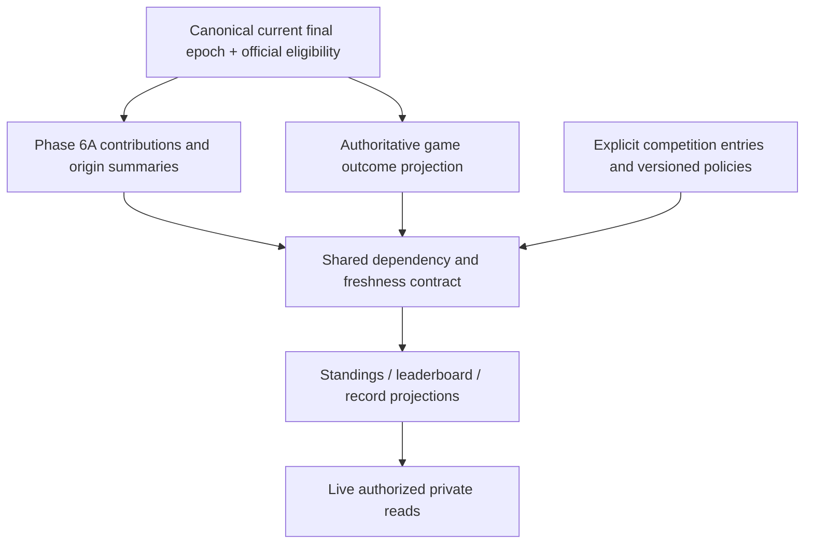

# Phase 6B — Standings, Leaderboards and Records

## Phase 6D seeding consumer

Tournament seeding consumes only a current published standings scope. Acceptance
copies the exact generation and rank into immutable tournament seed history;
subsequent ranking rebuilds do not rewrite it. Equal ranks stop automatic seeding.
Group crossover requires an explicit group scope/rank on each qualifying entry.
Bracket outcomes remain topology and do not double count in standings unless the
existing explicit competition game assignment says they count.

**Status: APPROVED PHASE 6B IMPLEMENTATION CONTRACT.**
October 5, 2026. Inspected branch `build/boss-platform-v1`, clean starting SHA
`e673eb1ffbad13a0eab57e79d4741c9c9822eb9a`, repository
`eaglevisiondigital/theboss`. PR #3 independently read as OPEN/DRAFT/UNMERGED
at that SHA. Phase 6A is COMPLETE. Local migration inventory contains 61 files;
canonical count 61 is the verified Phase 6A closure baseline, **not a fresh live
schema audit in this planning assignment**. No production connection, migration,
application change, deploy, temporary authority or hosted acceptance in this task.

Main Boss Chat approved the binding contract below. Earlier recommendations are historical design context.
The numbered sections map to its 50 required architecture topics. Names, policies,
RPCs and migration groups below are proposals, not implemented interfaces or grants.

## Binding Main Boss Chat decisions — supersede proposal recommendations

Main Boss Chat explicitly approves Phase 6B implementation, local runtime validation,
forward canonical migrations after fresh PostgreSQL validation, deployment and one
fixed controlled hosted window with independent administrator-first recovery. No 6C.
The eleven decisions below replace the proposal's former D1–D9 approval holds.
Historic proposal text below remains rationale; where it differs, this contract controls.

1. Stable Competition plus sport/season/cycle-specific Edition; reuse canonical identities.
   Explicit edition entries and bounded division/conference/pool/region groups, no inferred
   membership and no unrestricted hierarchy. Initial groups are flat; parent extension deferred.
2. Support single- and cross-organization editions. Explicit competition/edition-scoped
   manager assignments, never fake membership in participant organizations. Safe team outcomes
   may be shared under explicit competition policy; no roster/history/correction authority.
   Keep existing Game Center tenant FKs. Cross-org match bridge binds an existing owning-tenant
   canonical game to explicitly approved entries; source-result consent is separately checked.
3. Append-only explicit edition/game assignments, count flags and finite league/conference/
   division/nonconference/tournament/other classifications. Unique selected game per edition;
   assignment is independent of 6A eligibility. Canceled/postponed excluded; abandoned requires ruling.
4. Immutable activated standings policy for advanced ordering. Without it, safe raw W/L/T
   results only, equal teams remain tied; no hidden formula. Boss templates, Soccer 3/1/0
   configurable, margins off until configured. Finite ordered cohort/mini-table tiebreaks,
   1,1,3 ranking, explicit capped differential and explanations. Unsupported SOS stays foundation only.
5. Explicit immutable competition rulings and reversals. Unplayed forfeit can award outcome
   without game/player stats. Played facts remain intact. Default forfeit outcome only;
   standings-only score used solely when policy explicitly configures it. Reason/actor/effective time.
6. Private athlete-season/career and team-season leaderboards consume existing 6A composition.
   Counting requires official context, confirmed participation and compatible coverage.
   Partial candidates explicitly incomplete/unqualified unless policy permits their basis.
7. No universal sample minima. Finite configurable opportunities/GP/team-game-relative threshold
   types; a rate board requires explicit threshold policy to claim qualified leaders.
   Complete joint metric coverage default; ties stay tied, no age/DOB fabrication.
8. Private athlete audiences: authorized own-team staff and own-organization administration,
   not guardian/self peer access merely from underlying subject access. No new-team prior-origin
   career detail. Cross-org athlete comparison disabled initially; safe team results distinct.
9. Twelve finite keys: competition.view/manage/policy_manage; standings.view/manage/rebuild;
   leaderboard.view/manage/rebuild; records.view/manage/rebuild. No scoring-to-management mapping.
   Explicit competition manager resource assignments; publication capabilities deferred.
10. Six record categories, reproducible source/definition/policy/coverage/generation provenance;
    no arbitrary manually entered Boss record. ERA conventions and separate sports preserved.
11. Immutable recognition/disposition history, multiple co-holders, source achievement time
    separate from recognition. Source correction invalidates without deleting history;
    rebuild selects surviving best candidates and can restore a previous holder.

### Finite implementation choices within the approved direction

Use existing role catalog for potential capability and a dedicated resource-scoped
`competition_access_assignments` bridge. Extend roles' allowed-scope catalog vocabulary
for competition/competition_edition only; existing general role_assignments remain
unchanged and cannot accept those scopes. The new bridge validates its own concrete FKs,
role allowed scope, bounded status/windows and actor. A competition_manager role has only
competition-resource capabilities through that bridge, no organization membership/grant.

Proposed minimal capability matrix, subject to all actual scope/source/audience checks:
platform/organization administrator: all twelve keys at existing legitimate scope;
athletic director and program/sport administrators: scoped view/manage/rebuild for standings,
leaderboards and records plus competition.view; no competition.policy_manage or authority
assignment by default. Head coach/team administrator: exact-team competition/standings/
leaderboard/records view only. Scorekeepers, athlete/guardian and other roles gain no new
catalog mapping. Resource competition_manager: all twelve within exact competition/edition,
with athlete products additionally restricted to independently authorized same-org origins.
No source visibility or private career authority follows from that assignment itself.

Edition manager may manage competition metadata/results only. Foreign-team entries require
source-organization approval; canonical result sharing requires source-game manage consent.
Cross-org athlete board requests always deny initially. Same-org board audience still
requires reviewed ranking view key plus existing game/roster visibility per origin.
Org-scoped career boards compose only that org's authorized original slices via 6A;
team-scoped career composes only the exact authorized origin team, never transferred history.
Self/guardian rights alone produce no comparative rank/peer results.

Policy values are finite validated configuration: no hidden global threshold or rule order.
In-progress season/career records are qualified as-of-source achievements, never falsely
called final-season championships. Per-source chronological prefixes use existing 6A
reducers and immutable manifests, not a second stat engine. Future import/publication deferred.

All product reads/rebuilds paginated, not capped competition sizes. Preserve eight-second
statement timeout. Validate approximately 500 entries, 10,000 candidates, record depth
and concurrent work. Actual timings/counts must be reported, not fabricated SLA claims.

Implementation release is gated by fresh complete historical/new SQL/concurrency/app checks,
canonical preflight/body verification/types, advisors, deployment/CI and a separately frozen
single controlled window. Original administrator restored FIRST, exact baseline/zero work
verified before independent recovery retirement. No future phase, raw secrets or real youth data.

## Audited foundation and gaps

| Existing contract, inspected in source | Reuse / constraint |
| --- | --- |
| `organizations`, `organization_units`, `teams`, `seasons` | Stable identities, exact direct unit scopes, organization-qualified FKs. Units have a free-text `unit_type`; this does not prove an actual league/division exists. Team unit/season identity is immutable. Reuse genuine existing program/division units as anchors. |
| `organization_memberships`, `team_memberships`, `guardian_relationships` | Live, bounded authority and persistent person/participant identity. These are person relationships, **not competition-team entries**. Household alone is not guardian permission. |
| `roles`, `permissions`, `role_permissions`, `role_assignments` | Dotted permission keys; scope vocabulary platform/organization/organization_unit/team. No competition role scope exists. Do not expand this vocabulary silently. |
| `games`, `game_finalizations`, sport seals | Canonical event/occurrence, primary/opponent sides, season, home/away, immutable final epoch/score. Both internal teams have same-organization FKs. `competition_type` is only standard/tournament; it is not league membership. Canceled/postponed/abandoned statuses exist; explicit forfeit/adjudication semantics do not. |
| `stat_competition_classifications` | Immutable versioned official/exhibition/scrimmage/practice/controlled_test/excluded/pending eligibility. Its name does **not** mean a competition entity or standings assignment. |
| `stat_game_selections`, `stat_game_contributions` | Selected epoch, generation/refreshed generation; immutable normalized sealed components, coverage, participation, subject/origin identity and ERA basis. Single-game records reuse these contributions. |
| `stat_origin_summaries`, `stat_refresh_work` | Rebuildable origin slices, summary generation/source watermark, bounded dirty work. `is_current` alone is insufficient: inspect all dependent selectors, including newly entering sources. |
| Phase 6A read/rebuild/classification RPCs | Self/guardian-only career; narrowly authorized origin-season staff slices; team totals require existing source visibility. Read limits: eight refreshed games, 100 segments; eager reduction bounded at 2,000 contributions. Not a bulk leaderboard API. |
| Existing Game Center permission helper | Explicit allowlist of games keys, roster view and organization manage; it cannot evaluate new ranking keys without a reviewed extension/helper. Role mapping is potential capability only. |

No dedicated league, competition entry, conference, standings policy, ranking or
record-holder table exists in the audited migration inventory. No ranking permission
catalog was found. This is a repository/schema-contract audit, not a claim about
uninspected real organization unit rows or current production data.

Source anchors:
[identity/scopes](../supabase/migrations/20260930212410_phase2a_identity_organizations.sql),
[roles/relationships](../supabase/migrations/20260930212417_phase2a_relationships_access_governance.sql),
[Game Center](../supabase/migrations/20261004052521_phase5a_game_center_core.sql),
[Phase 6A core](../supabase/migrations/20261005210800_phase6a_intelligence_core.sql),
[materialization](../supabase/migrations/20261005210813_phase6a_intelligence_materialization.sql),
[reads/authorization](../supabase/migrations/20261005210820_phase6a_intelligence_reads.sql),
[approved 6A architecture](SEASON_CAREER_INTELLIGENCE_ARCHITECTURE.md),
[permissions](PERMISSIONS_MODEL.md), [tenancy](TENANCY_MODEL.md).
Executed 6A evidence remains in [its closure report](PHASE_6A_COMPLETION_REPORT.md).

## 1. Source model

Phase 6A remains statistical truth. Standings consume current canonical final results
through the Phase 6A selected-epoch/official gate, plus explicit competition decisions.
Leaderboards consume compatible current Phase 6A summaries. Single-game records use
selected `stat_game_contributions`; season/career records use Phase 6A composition.
No raw-play replay, alternate sport reducers, editable totals or copied career truth.

A proposed **internal Phase 6A batch/source contract** must expose bounded candidate
slices, joint formula components, coverage, participation, definition/units and a
complete dependency manifest. Reuse `stat_reduce`, `stat_rates` and `stat_compose`;
competition-filtered subsets require a bounded extension of that same composition
boundary, not new reducers in 6B. Existing paginated public reads cannot be scraped
and concatenated into a supposedly complete leaderboard. Any missing adapter is a
planned integration gap requiring approved implementation and regression coverage.

## 2. Standings scope

Use an explicit competition edition + sport + competition season scope. Organization,
exact unit, division and conference narrow that scope through explicit assignments;
no implicit descendant inheritance. Preserve underlying canonical organization/team/
season IDs in every source. “2026” text is not a cross-organization season identity.
An organization-wide standings table is still a declared competition with entries
and rules, not every team/game discovered in that organization.

## 3. Competition model

Recommend stable `competitions` with an owning existing organization and versioned
`competition_editions` for sport, time/season, policy and lifecycle. Link a genuine
organization/unit concept rather than creating another organization, league or team
for the same thing. Recommend initial execution inside one organization. An edition
is a competition season identity; participant organization seasons remain distinct.
No standalone league/division tables initially: optional competition groups represent
competitive grouping only when existing units cannot do so (§24 / D1).

## 4. Competition membership

An edition entry references `(team_organization_id, team_id, local_season_id)` and
an immutable, bounded membership episode; entry amendments append history. Prevent
overlapping contradictory entries, same-team duplicate entries and wrong-sport/season
associations. Actual game assignment fixes the relevant entry versions, so a transfer
or later withdrawal cannot rewrite old opponents or erase played results. A later
vacating/sanction must be an explicit adjudication. Competitive enrollment never
grants roster, person, game-operation or cross-tenant access.

Future cross-organization entries require two-sided approval from competition owner
and source organization, revocable narrowly shared result fields and participant-local
season mapping. Existing games cannot contain two internal tenants. Defer live shared
league execution pending D4; design a reviewed competition-match/result bridge rather
than weakening game FKs or inventing a team from an opponent name.

## 5. Game competition classification

Propose append-only edition/game assignment revisions with canonical source organization,
game/occurrence, entry sides, expected epoch, category, count flags, approved group
links, reason and actor/request. Categories can include league/conference, division,
non-conference, tournament and other; friendly/exhibition must still pass §6 and cannot
bypass the official gate. One game counts at most once per edition/ranking scope.
No inference from names, schedule recipients, event team targets or standard/tournament.
A game may contribute to distinct explicitly configured scopes; no duplicate contribution
within one. Retroactive reassignment dirties old and new projections and remains audited.

## 6. Statistical eligibility relationship

Official selected final epoch **and** approved standings assignment **and** edition policy
are required. Official does not automatically mean league/conference. Practice,
scrimmage, exhibition, controlled_test, excluded and pending never enter default official
products. Publication/archive is independent. Phase 6B cannot override classification;
its corrections use existing approved 6A reopen/classify/refinalize semantics when needed.
Competition exclusion may suppress a standings result without altering legitimate
athlete stats; it cannot promote an ineligible source into official athlete totals.

## 7. Standings policies

Immutable policy revisions define ordering basis, outcome handling, denominator,
points awards, score units, forfeit treatment, inclusion rules, tiebreak sequence,
missing-input behavior and supported manual resolutions. Bind an exact revision to
edition/group; never dynamically read an editable JSON formula. Finite validated DSL,
no SQL, arbitrary expressions or external execution. Draft/activate/supersede with
reason, optimistic revision and audit; revision activation dirties dependent scopes.
Policy changes produce new projection history, never rewrite old explanations.

## 8. Sport-specific defaults

These are **non-federation-certified templates requiring approval**, not active rules.
No universal tiebreak order or point-margin default.

| Sport | Template foundation | Optional policy inputs / limitations |
| --- | --- | --- |
| Basketball | W/L and W/decided games; explicit tie policy if applicable | Exact conference/division record; differential only approved/capped. |
| Soccer | W/D/L; configurable points (3/1/0 example only) | Goal difference, goals for, head-to-head if policy explicitly enables. |
| Football | W/L/T; proposed `(W + 0.5*T)/GP` | Conference/division, head-to-head; no unrestricted point differential. |
| Volleyball | Match W/L; sets won/lost | Set percentage `SW/(SW+SL)`; rally-point ratio `PF/PA`; distinguish match sets from points. |
| Baseball | W/L/T, explicitly configured tie weight | Runs/differential, head-to-head, conference/division. |
| Softball | Separate sport; W/L/T policy | Same foundation with separately approved rules, no Baseball numeric merger. |

Unsupported outcome/convention returns a policy diagnostic, not an invented winner.
Volleyball available team `set_wins` and points must be coverage compatible; absent
opponent set/point components are not zero. Federation-specific compliance is deferred.

## 9. Points systems

Exact numeric configured awards for win/draw/loss and approved bonuses/penalties.
Identify which game category earns each award. No guessed overtime/bonus standings
from raw plays. Display base points and explicit adjustment points separately.
Missing required sealed input means pending/unavailable, not zero. Policy must define
whether a vacated game changes denominator as well as points. Allow only finite,
bounded coefficients; thresholds/values await D2 and D7.

## 10. W/L/T and results

Derive outcomes from current authoritative finalization winner/tied fields, not UI
score text. Count qualifying completed games once per entry/side. GP=W+L+T under
ordinary decided-game rules; forfeits/voids follow explicit policy. Zero denominator
returns unavailable percentage, not 0% or 100%. Canceled/postponed games do not count;
abandoned/suspended remain excluded unless an authorized policy/adjudication makes
an official result usable. Home/away is relative to primary side; opponent reverses it,
neutral stays neutral. Conference/division records use assignment groups, not team labels.

## 11. Tiebreakers

Versioned ordered components: exact head-to-head result/points/percentage; direct
conference/division record; common opponents; permitted score difference or allowed
score; set percentage/point ratio; future strength-of-schedule. Explicit mini-league
rules for 3+ tied entries: games/meetings required, unbalanced schedules, recursion
restart after splitting versus continuing next step. Pairwise comparisons can cycle:
never use a non-transitive comparator in a generic sort. Partition tied cohorts at
each step. Missing/inapplicable evidence does not fabricate an advantage.

Differential configuration states per-game versus aggregate cap, signed cap, forfeit
inclusion, capped scope and ceiling. Recommended margin criteria disabled until
explicitly approved. SOS is a named extension, not a guessed implemented formula.

## 12. Unresolved ties

Recommended competition ranking: 1,1,3; separate shared rank/tie-group ID from stable
display order. Persistent entry ID provides final display stability only, never
statistical superiority. Exhausted/inapplicable tiebreaks remain tied/unresolved.
Manual/coin-flip outcome only where a policy allows, with decision evidence, actor,
reason and explicit scope. Boss does not silently toss a coin or sort by team name
as a winner. Any random resolution needs a reproducible recorded result, not reroll.

## 13. Forfeits

Audit found no canonical forfeit model. Propose a versioned competition adjudication
referencing existing game/entries and the resulting standings outcome, score treatment,
count/differential treatment, reason and policy. Pending decision is shown as such.
No assumed 2–0/7–0/1–0 score, automatic W/L award or fabricated athlete production.
Player totals remain 6A truth; any exclusion there requires its own existing canonical
correction. A forfeit without a played canonical game requires a separately approved
ruling-source contract, never a fake finalized game. D7 must approve initial support.

## 14. Administrative adjustments

Recommend finite audited append-only rulings for penalty points, vacated result or
sanctioned outcome with explicit reversal/supersession links. No direct result-table
editing. Lock expected policy/edition revision, validate exact scope and affected entry,
recheck permission, append idempotent actor/request receipt. Expose base result and
adjustment independently. Approval/dual-review requirements are D7, not assumed from
organization.manage. Adjustments cannot modify raw scores or athlete statistics.

## 15. Standings provenance

Each team row references edition/entry, policy revision, scope/group and projection
revision. Source manifest enumerates game organization/ID, selected finalization/epoch,
classification revision, assignment revision, local/canonical season, outcome and
adjudication revision. Group metrics/explanations reference the exact source set used.
Store checksums for comparison, not as substitutes for retrievable source evidence.
No team rename, withdrawal or organization merger relocates historical origin IDs.

## 16. Freshness

One proposed `ranking-v1` response envelope for all three products:

- `state`: current / refreshing / pending / unavailable; `as_of`, reason, scope and policy revision.
- `source_manifest`: full internal dependency set; authorized external subset only.
- `source_generations`: Phase 6A selector and origin-summary generations/watermarks;
  competition membership/assignment/policy/ruling revision; ranking target/published generation.
- `cohort_complete`, exact scope, qualification definition; results only when current.

Current requires all required sources present, 6A selector generation=refreshed generation,
all chosen slices current, matching source-set/policy/cohort revision and no missed new
candidate/source. `refreshing` means claimed bounded work; `pending` means invalidated
or queued; `unavailable` is unsupported/incompatible scope/data. Authorization failure
returns generic denial rather than revealing whether a hidden ranking/source exists.
Do not return stale values labeled current or a partial pool labeled organization leaders.
Read rechecks dependencies after waits; historical revision views, if authorized, are
explicit dated history. No application/CDN caching of private ranking responses.

## 17. Standings rebuild

Bound by edition/season/group, keyset-paginated canonical assignments. Stage immutable
inputs and calculate outcomes/tiebreaks from the manifest; no raw game replay. Publish
only at the still-current target generation; otherwise retain pending/retry. Incremental
replacement and full rebuild must have identical source membership, values, tie partitions
and explanation payload. Rebuild result rows are disposable; policy, membership,
assignment and ruling history are canonical. Large scopes use resumable chunks, not
silent truncation to an arbitrary top-N source list.

## 18. Leaderboards

Three supported design kinds: athlete-season, athlete-career, team-season. Key by
explicit authorized cohort, sport, stat definition/version, season or career context,
origin filters and qualification policy. Use current 6A components, not editable totals.
Metric definition includes units, direction (e.g. ERA lower is better; counting goals
higher), valid values and compatibility class. No arbitrary cross-sport comparisons.

Career candidate support is **not a grant**: current 6A career RPC permits self/guardian
only. General organization/team comparative career boards need D5 approval and a narrowly
reviewed origin-history projection. An organization-wide person-career sum or current-team
membership cannot open other-team history. Unsupported audiences fail closed until decided.

## 19. Leaderboard eligibility

Separate participation/canonical eligibility, disclosure authorization and performance
qualification. Candidate may be authorized but unqualified, or not disclosed at all.
Finite rules consume supported 6A GP, opportunities and compatible components. Return
`qualified`, `insufficient_sample`, `insufficient_coverage`, `incompatible_definition`
or `not_applicable` with safe reasons. Do not show a private subject's exclusion to an
unauthorized viewer. Current roster alone never establishes played GP.

## 20. Coverage and sample thresholds

Policy revisions specify minimum confirmed GP, supported minutes, attempts/PA/pitching
outs/attack attempts/targets and required joint coverage. Examples are configurable
foundations, **not approved numeric thresholds**. Unsupported minutes/position data
disables the rule, not substitutes zero or a fabricated value. Pitching workload is
integer outs, never decimal baseball innings.

Complete joint components are recommended for rate qualification. Partial observed
counting leaders, if approved, must be separately labeled and never mixed with complete
counting totals as equivalent evidence. Track complete/partial/untracked/legacy unknown
counts and applicable cohort. Require explicit policy for partial qualification, with
sample threshold evaluated in the same tracked source cohort as the rate. D3 owns thresholds.

## 21. Counting versus rate metrics

Counting leaders use the 6A reducer appropriate to the definition (SUM or supported MAX
for longest performance), not generic summation. Rate leaders compare exact compatible
aggregate numerator/denominator components; no mean of per-game percentages. Rank exact
numeric ratios/cross-products and round only display; apparent rounded equality must
be explained. OPS retains its two jointly covered component fractions. Zero opportunity
is unavailable; negative legitimate Volleyball hitting values remain valid.

## 22. Leaderboard ties

Recommend competition ranking 1,1,3 over exact qualified values. Stable canonical
subject/entry ID for display; no invented tiebreak by surname, most recent performance
or more attempts unless the approved qualification/ranking policy explicitly defines it.
Top-N page boundary includes a tie-aware continuation so equal rank is not hidden.
Cursor binds cohort, filter, policy and generation; generation change invalidates it.
Do not expose hidden candidate counts via ranks or pagination.

## 23. Filters and scopes

Sport, canonical season, exact organization/unit/team, approved edition/group and
supported sealed position scope. Team membership now does not change historical-origin
filters. No grade/age/DOB filters until approved existing data and disclosure policy
support them; no inference from jersey, school year or name. Current roster position
cannot relabel old sealed performances. Arbitrary career organization-set filters cannot
be used to subtract totals and discover unauthorized origin slices. Validate all filter
IDs together, not independently existing UUIDs.

## 24. Leaderboard privacy

Recommend private exact-team and organization boards as distinct audience policies.
“Private” alone does not authorize peers' statistics. The whole comparison cohort,
its individual slices and source visibility need explicit approved disclosure rights.
Do not compute the full private ranking then redact names: rank/percentile/value/count
can leak hidden athletes. If only a subset is authorized, deny the full board or offer
an explicitly defined authorized-cohort board with its own scope label, not false full
rank. A candidate absent from an authorized cohort reveals no hidden qualification reason.

Genuine existing division/conference units may anchor groups. If competition-specific,
season-varying or cross-tenant groups have separate semantics, propose `competition_groups`
and explicit entry assignments; do not overload unit_type or create duplicate program
units. No new competition grant can bypass underlying athlete disclosure policy (D1/D5).

## 25. Records

A record is the best qualifying compatible measurement within a declared scope and policy,
not a mutable manually chosen holder. Same stat metric direction/coverage/eligibility
contract as leaderboards, with stricter reproducible provenance and immutable record
recognition/disposition events. Current holders are a rebuildable projection. No public
records or automatically imported legacy claims.

## 26. Record categories

Single-game athlete, season athlete, career athlete, single-game team, season team and
organization historical record. Every category retains sport/origin and canonical season
where present. Organization historical means stable organization ID, not merged names.
Team rename retains identity; team replacement does not silently inherit records.
Initial organization/career audiences and whether in-progress season achievements are
provisional versus eligible official records require D5/D8. Archive status alone is not
proof a season is complete. No unsupported completed-season freeze is presumed to exist.

## 27. Record provenance

Record evidence references person/participant where applicable; original organization,
team, sport, season, game/final epoch/roster revision, contribution or aggregate source
manifest, generation, stat/formula/engine and eligibility/policy versions, coverage,
units and ERA basis. Separate `performance_at`, `recognized_at`, policy effective time
and disposition time. Proposed deterministic establishment-time rule uses canonical
source cutoff/last required qualifying performance; delayed backfill recognition is not
backdated execution. Approve chronology and active-season semantics under D8.

## 28. Record ties

Multiple current holders for exactly equal qualified value under compatible definition.
A later tie appends recognition without superseding equal existing holders. Deterministic
event/measurement identity prevents duplicate holder from replay. Rounding never creates
or breaks a record tie. A correction removing one co-holder leaves the other valid holders.

## 29. Record supersession

Append transitions: recognized, co-holder added, surpassed, invalidated by correction,
restored, policy superseded. Never delete old record events/holders or rewrite original
recognition. Current projection points to all best surviving candidates; a worse value
never replaces them. Event reasons/source manifests distinguish performance progression
from correction or policy change. Historical recognition is evidence of what was known,
not an assertion an invalidated performance remains currently valid.

## 30. Refinalization behavior

Source status/epoch or classification change dirties affected standings/boards/record
scopes through 6A dependencies in the same invalidation transaction. Reopen removes
current eligibility; a higher new epoch replaces, never adds to, the old game. Refresh
reuses 6A current composition; old immutable seals remain audit evidence only.
A corrected record can disappear, restore an older surviving record or produce a new
holder. Recompute from **all qualifying candidates**, not only previously winning rows.
Preserve prior transition history; append correction disposition deterministically and
idempotently. Membership changes dirty scope/audience independently of numerical totals.

## 31. Historical definition compatibility

No blind comparison of engine versions, formula meanings, unit conventions or legacy
coverage. Bind comparison to finite versioned compatibility mapping; unknown/incompatible
sources are separated/excluded with reason. Preserve original measurement and definitions;
new mapping/policy creates a new ranking generation. Imported or untracked zeros do not
become complete Boss records. No retroactive reinterpretation of earlier recognition.

## 32. Mixed ERA conventions

Preserve 6A workload outs and sealed basis innings: Baseball 9, Fastpitch Softball 7
where those conventions apply. Mixed/unknown ERA basis yields unavailable mixed ERA.
No combined ranking/record across incompatible bases without separately approved
normalization; no substitute averaged ERA. A policy may require a single basis and
exclude incompatible candidates with safe reasons. Baseball/Softball remain separate.

## 33. Authorization

Separate private calculation, policy/membership/ruling management, authenticated viewing
and future publication. Potential permission AND live exact scope/relationship AND
approved cohort disclosure AND source visibility/feature state are required. Guardian
rights cover their child, not peers; household or scoring role grants no ranking access.
Competition owner cannot inspect member organization's private athlete career by owning
competition metadata. Preserve staff origin-season and self/guardian history boundaries.

Use existing managed live Auth/account checks and resource anchors; recheck current
windows after waits and before returning. RLS on all proposed tables; revoke raw PUBLIC,
anon/authenticated/service_role ACLs following Boss RPC-only pattern. Public invoker
wrappers enter private caller-bound finite authorization functions; empty search paths,
explicit EXECUTE allowlists, no user_metadata authority. Add ranking-specific helper
rather than feeding new keys into the games helper's existing finite allowlist.

## 34. Publication boundary

Default private. No public leaderboard/record endpoint, anonymous access, public profile,
sharing link or publication UI in initial implementation. Reserved publication permission
names confer no operation. Future publication requires explicit approved youth consent,
field/audience policy, withdrawal handling and tenant contribution agreements; published
game status does not publish athlete rankings. No DOB or new consent facts invented.

## 35. Materialization

One shared ranking scope/dependency/refresh framework; three distinct calculators over
6A/outcome inputs. Recommend rebuildable per-game standings contributions, current
standings table, per-scope/stat leaderboard candidate/value cache and current record
holders. Cache raw totals only as disposable projections with source IDs/generation;
not independently editable canonical stats. Immutable record events/policies are audit
evidence; derived holder pointers alone are never the statistical source of truth.

Scope generation includes changes to source *set* as well as existing source values:
new games/subjects, old/new assignments, classification epochs, policy/entry/ruling
revision and source composition. Do not use MAX(summary.generation), timestamp-only
checks or watermark of old selected members to miss a new candidate. Dependency reverse
indexes plus authoritative scope/cohort revision fence prevent phantom insertions.
Retain normalized manifests; no large names/profile/secret blobs per candidate.

## 36. Concurrency

Use sorted canonical event/game source lock order established by 6A; don't call refresh
while holding ranking or authority locks. Invalidation coalesces target generations and
bounded dirty work, never performs an entire board under a game mutation lock. Worker
uses transaction-scoped advisory try-lock per product/scope/stat/revision; abandoned
claim expires and retry is idempotent. No session lock held across pooled requests.

Stage calculation from immutable inputs/current dependency vector, then short publish
transaction: acquire ranking scope fence, compare source/cohort/policy target generation,
CAS publish if unchanged. No waiting for source locks while holding ranking publish fence.
Invalidation hooks obey the same order; worker cannot mark work done for a newer target.
If needed publish/dirty conflict aborts/retries; no long reverse lock path.

Private reads check freshness before authority locks, lock/recheck existing live authority
anchors and ranking fence in proven order, and validate generation again. Revocation
linearizes with that check; stale repeatable-read snapshots fail/retry, not authorize
from old rows. Large boards need reviewed bounded authority checks, not weakened locks.
§48 lists concrete coordinated races; lock ordering is a design to prove, not a tested claim.

## 37. Audit and explanation payload

Standings explanation: included/ignored source IDs (only authorized fields), W/L/T or
base points, adjustments, each tiebreak step's cohort/comparison input/result/skipped
reason, configured cap and unresolved tie. Qualification: definition, same-cohort sample
threshold versus measured opportunities, coverage state and exclusion reason. Records:
source/definition/policy versions and ordered recognized/superseded/corrected transitions.
No hidden athlete/source counts or private details in explanation/error payloads.
Request receipts bind actor, exact command/scope and reason; replay reauthorizes current
rights and cannot append another ruling/resolution/event. No credentials in audit.

## 38. Performance

Index organization/edition/season/sport scope first, then team/subject/stat/definition;
index every composite FK and reverse source dependency. Candidate ranking index supports
scope+policy+generation+direction/value+subject cursor; exact rate comparison remains
numeric, with stable sortable materialization where validated. Keep source manifests
paged; do not place every organization's history in one huge JSON row. No raw replay
on page requests, unbounded career scans, N public-RPC calls for N candidates, or full
ranking rebuild in game finalization. Work and API page sizes fixed/server enforced.

Propose load oracle covering 10,000 organization-shaped tenants plus skewed large scopes,
small-team hot reads and large candidate pools; measure EXPLAIN ANALYZE/BUFFERS, P95/P99,
lock time, work backlog, invalidation fanout and write amplification. Fixture volumes and
latency budget need implementation approval; 6A benchmark is not proof of 6B capacity.
Authorization joins remain inside the server query; caching never crosses audience/cohort.

## 39. UI concepts

Boss-native private tabs: Standings (rank/team/W-L-T or points/sport columns with expandable
explanation); Leaderboards (stat, qualification, coverage, exact scope filters, tied rank);
Records (category, co-holders, value, originating season/game/date, prior history).
Display current/refreshing/pending/unavailable, denied and empty-qualified-cohort distinctly.
No false numeric zeros for unknowns. Rebuild management and policy activation are separate
controls from game scoring. Desktop/390px/320px validation and native navigation required;
no phase 6C profile page or publicly linked youth identity.

## 40. Family Hub and athlete context

Own/dependent records and statistical context reuse approved subject relationship checks.
“Child1 ranks 4th” appears only if the viewer is authorized for the full specified board,
not merely Child1's metric. Deny hidden rank/count/percentile derived from private peers.
If board unauthorized, show existing child-only season/career history, no comparative
claim. Family link and scoped filters preserve subject, sport/origin and permission;
household grouping does not create guardian rights.

## 41. New-team privacy

Transferred athlete keeps person/participant and sealed origin. Current-team leaderboards
may use authorized current-origin slices, not private prior-team individual values.
A new coach cannot obtain prior correction authority, season history or full career by
joining a competition/knowing a record ID. Subject/guardian historical access remains
under its live relationship contract. Record recognition retains original org/team/season,
not a current roster affiliation. Tests separately check safe team-level outcomes and
private athlete detail to avoid labeling legitimate score visibility as leakage.

## 42. Legacy and import boundary

No legacy import/manual historical record entry in initial 6B. Future recommendation:
separate imported claim with citation, confidence, review state, origin/definition and
consent; never present as verified Boss canonical record. Mergers/renames do not merge
organization history; migration/identity decisions require separate approval. Preserve
unknown coverage and pending statistical eligibility, not guessed complete official data.

## 43. Proposed tables

Illustrative names, no DDL or migration files created. Each has immutable identity,
audit/version semantics, composite resource validation and indexes. No generic unsafe
polymorphic source ID without typed FK/check validation.

| Proposed storage | Purpose / canonical versus derived |
| --- | --- |
| `competitions`, `competition_editions` | Canonical stable competition and season/sport edition; existing owner org and optional real unit anchors. |
| `competition_groups`, `competition_entry_groups` | Conditional competitive divisions/conferences where units insufficient; explicit membership revisions, no permission hierarchy. |
| `competition_entries`, `competition_entry_revisions` | Canonical team/local season participation episodes and amendments. |
| `competition_game_assignments` | Canonical append-only game/entry/group/count-category decisions and epochs. |
| `ranking_policy_revisions`, `ranking_policy_assignments` | Finite typed standings/qualification/record contracts, immutable versions and activation. |
| `competition_adjudications`, `competition_tie_resolutions` | Conditional approved forfeit/sanction/manual tie rulings and reversal history. |
| `ranking_scopes`, `ranking_source_dependencies`, `ranking_refresh_work` | Shared derived generation/cohort fencing, reverse manifests, coalesced work/claims. |
| `standings_game_contributions`, `standings_snapshots`, `standings_rows` | Rebuildable outcome projection and ordered table/explanations, no editable score truth. |
| `leaderboard_candidates`, `leaderboard_rows` | Rebuildable values/qualification/order referencing 6A source manifest. |
| `record_measurements`, `record_events`, `record_current_holders` | Rebuildable qualifying candidates; immutable recognition/disposition evidence; derived current pointer/co-holders. |
| `boss_private.ranking_operation_receipts` | Actor-bound idempotency, closed raw access. |

Shared cross-org result/disclosure agreements and match bridge are **future conditional
proposals**, not included by default. Organization-owned composite keys cover ordinary
FKs; explicit competition entry referencing another tenant requires reviewed boundary
validation and agreement, not a bare UUID shortcut. No new person/team/season copies.

## 44. Proposed RPCs

Finite authenticated invoker endpoints: `boss_competition_read`,
`boss_competition_mutate` (approved finite create/entry/game-assignment/policy/ruling
commands), `boss_standings_read`, `boss_leaderboard_read`, `boss_records_read`,
`boss_ranking_explain`, `boss_ranking_rebuild`. Validate exact IDs/revisions, maximum
input/page bytes, enum filters and scope-bound generation cursor. Command request UUID
is idempotency only, never a caller authority token. Rebuild bounded competition-season,
team-season, board scope/stat or record scope/stat; cannot disclose what read would deny.
Private worker helpers not executable by clients. No publish/import/anonymous RPC,
no arbitrary SQL/stat expressions. Proposed batch 6A composition helper is internal and
preserves 6A authorization plus approved candidate-cohort rules; not a service-key browser API.

## 45. Proposed permissions

Reuse existing roles/catalog and dotted key conventions. Candidate catalog keys:
`standings.view`, `standings.manage`, `leaderboard.view`, `records.view`, `records.manage`;
recommend `competition.view`, `competition.manage`, `ranking.rebuild` for distinct
configuration/work capability. Whether to consolidate management keys is D6. Reserved
`standings.publish`, `leaderboard.publish`, `records.publish` have no initial grant/API.
No automatic map from games.operate/manage/publish, no new role and no new competition
scope kind initially. Exact organization/unit/team assignment plus full actual resource
scope is checked; authority over one entry cannot manage an entire competition.

Main Boss Chat must approve explicit role-permission matrix and audience rules before
catalog/mapping implementation. Membership grants potential viewing only if separately
approved; no peer disclosure assumed. Even platform potential remains subject to private
career/guardian boundaries. Calculation worker authority does not grant result viewing.

## 46. Proposed migration sequence

After separate implementation approval only, propose logical forward groups (no filenames,
SQL, migration count promises or production authorization in this document):

1. Competition identity/entries/assignments and immutable constraints; conditional groups.
2. Finite policy/adjudication/receipt contracts, RLS/ACL plus approved permission mappings.
3. Bounded integration with existing 6A composition and invalidation; shared dependency/work model.
4. Standings, leaderboard and record projections/history/rebuild and finite authenticated APIs.

Atomic security boundaries at every intermediate migration; no partially exposed tables.
All groups disposable-PostgreSQL validated first; no automatic official classification
or public backfill for old data. Explicit release authorization, canonical preflight,
version/hash/type checks and safe deploy gates required later. Live count remains 61 now.

## 47. Proposed SQL tests

Independent frozen sport/result/component oracles, not only implementation mirrors:
all six sports W/L/T/score units; configured points; head-to-head 2/3+ cycles/unbalanced
schedule and restart rules; common opponents; capped margin; tied 1,1,3 and missing inputs;
forfeit/no fake stats; reversed sanctions; zero GP; canceled/postponed/abandoned exclusion;
all seven 6A classification states; official-but-nonleague exclusion; duplicate assignment;
wrong epoch/season/entry/tenant/group references; rate/count direction, sample boundaries,
negative ratios, NULL denominators, no percentage averaging; complete/partial/untracked/
legacy unknown; unused roster GP; ERA incompatibility and Base/Softball separation.

Record better/worse/equal, co-holders, correction rollback/restored prior holder, immutable
history, same numerical total but different source-set and policy compatibility.
Full rebuild equality checks manifests as well as values/order/explanations. Delete derived
caches in disposable DB and reconstruct current results; retain canonical decision/audit
history. SQL authorization matrix: anon/raw ACL/worker execute, finite search paths,
exact team/direct-unit/sibling/tenant, self/guardian/household-only, staff prior origins,
publication disabled, expired/ended authority, forged IDs and scope/cursor/value inputs.
No assertion count claimed until test implementation/review.

## 48. Proposed concurrency tests

Barrier-coordinated tests with independent expected source manifest:

1. Finalize versus standings read/refresh: old generation never returned as current.
2. Reopen/refinalize versus refresh: one current epoch and old removal/new replacement.
3. Two workers same scope: one publication, no duplicate record transition/work loss.
4. Entry/group/assignment update versus read: exact cohort fence, no phantom membership.
5. New official game/candidate versus leaderboard publish: source-set invalidation catches addition.
6. 6A summary update versus leaderboard refresh: no mixed generations/components.
7. Record recognition versus refinalization: invalidated winner cannot remain current.
8. Simultaneous record-breaking games/co-records: deterministic surviving best set.
9. Policy activation/ruling reversal versus rebuild: obsolete policy cannot publish current.
10. Guardian/team/role revocation or expiry versus read and after lock wait: stale snapshot denied/retried.
11. Source lock versus ranking fence: bounded try-lock/retry, no deadlock or reverse blocking.
12. Worker crash/expired claim/replay and cursor generation change: convergence, safe restart.

Run relevant races under READ COMMITTED and stale REPEATABLE READ. Source identity,
permissions and work target must be revalidated after waits. Existing timeouts are not
to be extended simply to hide deadlocks. Final timings/counts remain future evidence.

## 49. Proposed hosted acceptance

Only after implementation, runtime validation, release and **separate exact window
approval**. Existing synthetic controlled context; no credentials/session export, real
youth/customer data, invented DOB, raw sensitive document or test-only endpoint.
Preflight exact baseline; independently rehearsed administrator-first recovery before
any pause; fixed activation/stop-new/cleanup/hard-expiry with bounded grants, no extension.
No temporary authority is activated by this architecture task.

One reviewed scenario plan: native internal competition standings and explanation;
approved configured points/tiebreak with shared/unresolved rank; authorized counting/rate
board with coverage/threshold exclusions; record better/equal/superseded history; existing
controlled no-stat-change refinalization updates all dependent products exactly once;
incremental=rebuild; known pending honesty; unrelated child/team/unit/tenant and stale
resource denial; guardian-owned context without peer leakage; new-team prior-career and
correction denial; private/anonymous boundary; navigation/reload and actual 320/390 layouts.
Only approved existing fixtures and policy audiences: unsupported cross-org/career
comparisons remain denied/deferred, not fabricated positive evidence.

End new scenarios before deadline; explicit administrator-first restoration, relationships/
modules/configuration baseline; remove controlled official ranking/record effects through
approved canonical classification/ruling recovery, not archive alone; archive/unpublish
as intended, drain only bounded controlled work, verify zero residual authority and
native original admin. Preserve audit/history and label any tooling/fixture limitation.
Do not promise this future plan already has approval for grants/mutations/refinalization.

## 50. Explicit deferred work

Cross-org live league sharing/match bridge until approved; public leaderboards/records,
publication consent/UI, Phase 6C profiles/recruiting, awards/badges, tournament brackets,
legacy import/manual historical record entry, federation certification, arbitrary
advanced metrics/SOS formulas, DOB/age segmentation without data, external processor or
provider infrastructure. No fundraising, Boss Bucks, Money Board, payments, commerce,
SMS/Twilio, push provider, livestream or later module. No implementation before approval.

## Historical proposal decisions — resolved by the binding implementation contract

| ID | Proposed direction / decision required | Safe behavior while undecided |
| --- | --- | --- |
| D1 | Approve internal competition + edition + explicit entries; conditional groups versus genuine existing unit reuse. Define entry withdrawal/group history and retroactive assignment effective rules. | No inferred competition/membership. |
| D2 | Choose initial sport templates, points/denominator, exact ordered 2/3+ tiebreak rules and margin caps (recommended off by default). | Draft policy only; no claimed official standings. |
| D3 | Approve per-stat sample thresholds and complete-joint coverage; decide separately labeled partial counting leaders. | Unknown/insufficient rates unqualified; no invented thresholds. |
| D4 | Recommend first release internal to one organization. Approve future cross-org result fields, membership consent/revocation and match bridge separately. | Foreign-tenant execution denied; current Game Center FKs unchanged. |
| D5 | Define exact-team/org athlete comparison audiences, guardian comparative access and career leaderboard/record origin disclosure. | Self/guardian child statistics only; no peer or new-team prior-career leakage. |
| D6 | Approve explicit role-permission matrix, management/rebuild keys and feature-entitlement placement (recommend Sports configuration, no new module by default). | No new catalog/mapping/role created. |
| D7 | Approve forfeit and administrative ruling types, score/differential/stat separation and manual resolution review authority. | No synthetic scores/stat changes; unresolved remains unresolved. |
| D8 | Approve record establishment chronology, in-progress season provisional treatment, compatibility and historical retention/disposition rules. | No uncertified active-season record declaration. |
| D9 | Approve implementation batch scope, bounded report/load budgets and acceptance fixture/grant plan later. | Planning only; no tests falsely claimed executed or release authority inferred. |

## Planning verification and technical references

Verified clean starting HEAD/branch and remote PR metadata, counted 61 local migrations,
audited source tables/helpers/RPCs plus generated contract limitations. Checked 50 topic
sections, file links, proposed-vs-existing labeling and documentation-only diff. No full
application/database suite rerun for this reversible documentation assignment; Phase 6A
executed test results are historical baseline, not Phase 6B passes.

Technical approach follows [Supabase RLS/ACL guidance](https://supabase.com/docs/guides/database/postgres/row-level-security)
and [PostgreSQL 17 transaction/advisory locking](https://www.postgresql.org/docs/17/explicit-locking.html).
Public Supabase changelog fetched October 5; inspected the
[PostgreSQL 17.11 compatibility notice](https://supabase.com/changelog/postgres-15-19-17-11-breaking-changes).
No dependency, extension or runtime upgrade is proposed here; later implementation
must recheck relevant current documentation. Technical references do not establish
sport federation rules or approve product policy. Architecture checkpoint history; approved implementation now proceeds under the binding contract.

## Implemented local contract checkpoint

The binding eleven decisions above supersede the historical planning proposal.
Four forward migrations, private native UIs and finite RPCs implement stable
competition editions, explicit safe cross-org team entries, versioned assignments/
policies/rulings, whole-cohort ties and bounded comparative products. All twelve
potential keys have an independently tested least-privilege role matrix. Exact
CompetitionManager uses its dedicated bridge; legacy role scopes are preserved.

Seventeen public tables plus private receipts close raw client access immediately.
Group/edition record histories and current holders bind to their exact scope with
composite FKs. Athlete products remain originating-scope private; guardian/self
statistics do not grant peer rank, and cross-org athlete/public sharing is disabled.
Native forms use six finite Boss templates and explicit rate minima. Canonical
Phase 6A reducers, eligibility, source chronology and generation dependencies are
reused; record invalidation recomputes all survivors without deleting history.

Current production remains the Phase 6A/61-migration baseline pending completion
of the fresh full database gate. See PHASE_6B_VALIDATION.md for actual results,
including the corrected local performance issue; no unobserved hosted result is
claimed. Historical proposed/deferred descriptions above remain planning history.

## Phase 6E recognition consumers

Definitions reference existing ranking definitions/scopes and immutable record events.
Qualification, complete rate coverage, generation freshness and comparison audience
remain authoritative; a badge cannot broaden ranking visibility. Co-holders remain
co-holders, former holders may retain historical recognition, and canonical correction
invalidates current presentation while preserving history. A standings championship
requires an explicit current-generation close snapshot with one resolved first place
and no outstanding counting result. No new ranking/statistics reducer is introduced.
